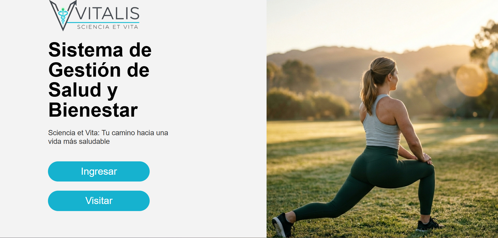
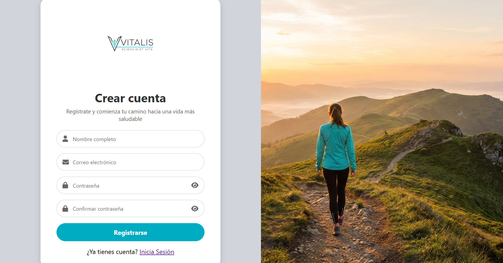
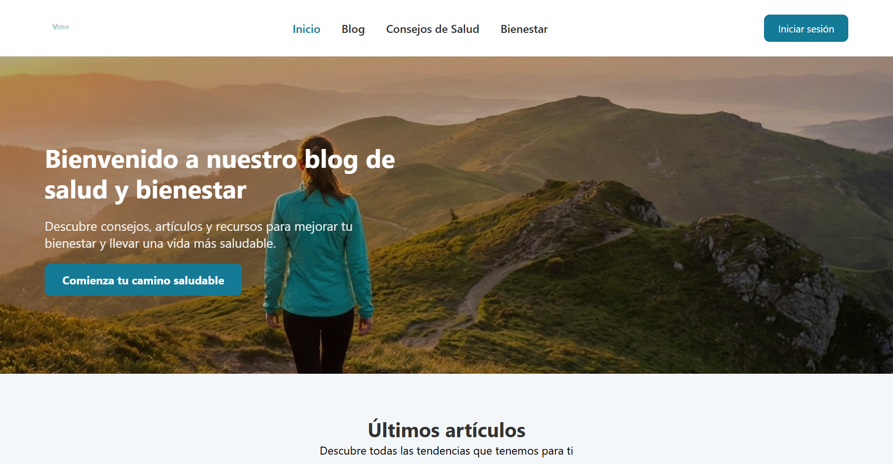
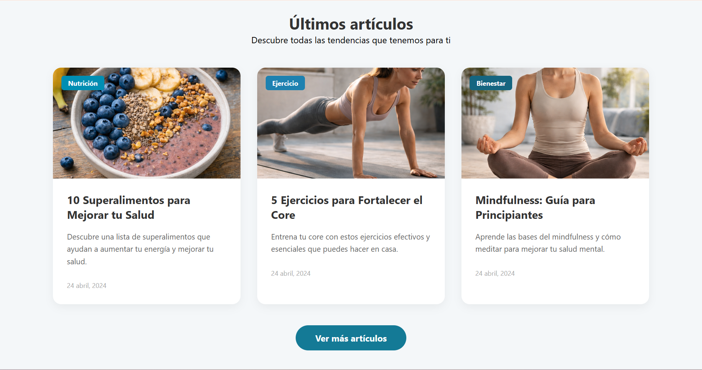

<p align="center">
  
</p>

<h1 align="center">V I T A L I S</h1>

<p align="center">
  <em>Scientia et Vita — Ciencia y Vida</em>
</p>

<p align="center">
  
  
  
  
  
</p>

<p align="center">
  
  
  
</p>

---

## 📌 Descripción

**Vitalis** es una plataforma web educativa orientada a la promoción de la salud y el bienestar, alineada con el **Objetivo de Desarrollo Sostenible 3 (ODS 3)** de las Naciones Unidas. Ofrece información confiable, accesible e interactiva sobre hábitos saludables, prevención de enfermedades y bienestar integral, apoyando la concientización de estudiantes y comunidades educativas.

---

## 🎯 Objetivos

### General
Evaluar el impacto de una plataforma web educativa sobre el ODS 3 en los conocimientos y actitudes de estudiantes relacionados con la alimentación saludable, la actividad física, la prevención de enfermedades y la salud mental.

### Específicos

| # | Objetivo | Metodología |
|---|----------|-------------|
| 1 | **Identificar** información confiable sobre ODS 3 | Análisis documental |
| 2 | **Diseñar** la estructura y contenidos de la plataforma | Análisis de requerimientos |
| 3 | **Desarrollar** un prototipo funcional | Trabajo en laboratorio |
| 4 | **Evaluar** la usabilidad con usuarios reales | Pruebas de campo |
| 5 | **Analizar** el impacto en el nivel de conocimientos | Análisis de datos |

---

## ✅ Propuesta de Valor

Vitalis centraliza la gestión de salud preventiva en un solo lugar, permitiendo a los usuarios:

- 📰 Acceder a contenido educativo sobre salud y bienestar
- 💬 Interactuar con una comunidad mediante un blog social
- 🎓 Desbloquear cursos de bienestar ganando puntos
- 🎮 Aprender jugando con minijuegos de bienestar
- 📊 Monitorear su progreso y actividad dentro de la plataforma

---

## 🚀 Funcionalidades principales

### 👤 Gestión de usuarios
- Registro seguro con validación de dominio de correo
- Inicio de sesión con control de sesiones
- Recuperación de contraseña por correo
- Roles: Visitante, Autor, Editor, Administrador

### 📝 Blog social
- Publicación de posts con texto, imágenes y videos
- Sistema de likes y dislikes en tiempo real
- Comentarios con moderación automática
- Búsqueda de contenido por hashtags

### 🛡️ Moderación de contenido
- **Sightengine API** — detección automática de imágenes inapropiadas (nudez, armas, drogas, gore)
- **Filtro de groserías** — lista bilingüe (ES/EN) con detección de variaciones con espacios y caracteres
- Validación de dominios de correo permitidos

### 🎓 Sistema de cursos
- Cursos organizados por categorías (nutrición, ejercicio, bienestar, salud, mindfulness)
- Desbloqueo de cursos con puntos ganados en juegos
- Seguimiento de cursos completados en el perfil

### 🎮 Juegos Bienestar
- **Tetris Vitalis** — minijuego integrado con sistema de puntuación
- Tabla de clasificación global (Top 10)
- Los puntos ganados se usan para desbloquear cursos

### 👑 Panel de Administración
- Gestión de usuarios (cambio de roles, eliminación)
- Moderación de comentarios
- Estadísticas de la plataforma
- Categorías más populares por likes

### 🌙 Modo oscuro
- Toggle flotante disponible en todas las páginas con sidebar
- Preferencia guardada en `localStorage`
- Sincronizado entre todas las interfaces

---

## 🛠️ Tecnologías utilizadas

| Categoría | Tecnología |
|-----------|-----------|
| Frontend | HTML5, CSS3, JavaScript |
| Backend | PHP 8.4 |
| Base de datos | MySQL |
| Servidor | Apache — Hosting IONOS |
| Moderación | Sightengine API |
| Iconos | Font Awesome 6 |
| Tipografía | Google Fonts (Outfit) |

---

## 🏗️ Arquitectura del proyecto

```
Vitalis/
├── public/
│   ├── assets/
│   │   ├── css/          # Estilos por página + sidebar global
│   │   ├── js/           # darkmode.js y scripts
│   │   └── img/          # Imágenes y logotipos
│   ├── config/
│   │   ├── Database.php
│   │   └── filtro_grocerias.php
│   ├── controllers/      # Lógica de negocio (PHP)
│   ├── uploads/          # Imágenes subidas por usuarios
│   │   ├── fotos/
│   │   ├── portadas/
│   │   └── posts/
│   └── *.php             # Vistas principales
└── README.md
```

---

## 🖥️ Interfaces

<p align="center">
  Vista previa de las interfaces principales del sistema Vitalis.
</p>

<p align="center">
  
  
  
  
  
  
</p>

---

## 👥 Equipo de desarrollo

<table align="center">
  <tr>
    <td align="center"><b>Amador Benítez Juan</b></td>
    <td align="center"><b>Escobar Núñez Cristian Alexander</b></td>
  </tr>
  <tr>
    <td align="center"><b>Hernández Campos Itzel Aranzazú</b></td>
    <td align="center"><b>Virgen Ambriz Lucía Lorena</b></td>
  </tr>
</table>

---

## 🏫 Contexto académico

> Proyecto desarrollado en el marco del **ODS 3 — Salud y Bienestar** de los Objetivos de Desarrollo Sostenible de la ONU.
> Universidad de Colima — 2026

---

<p align="center">
  Hecho con ❤️ por el equipo Vitalis · <em>Scientia et Vita</em>
</p>
